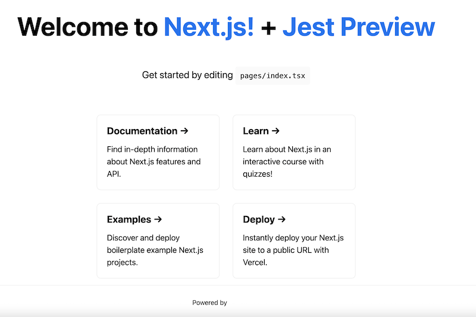

## Examples

- [Jest Preview with Next.js Rust-based compiler](https://github.com/nvh95/jest-preview/tree/main/examples/nextjs)
- [Jest Preview with Next.js Babel](https://github.com/nvh95/jest-preview/tree/main/examples/nextjs-babel)

## First-class support for Next.js Rust-based compiler for Jest

We want [Jest Preview](https://jest-preview.com) to have the best DX for all frontend developers. Besides, [Next.js](https://nextjs.org) is a wonderful and extremely popular React framework that is powered by [Vercel](https://vercel.com). So we are providing a first-class support for Next.js by offering an adapter to integrate Jest Preview to Next.js effortlessly, [thanks to great work](https://github.com/nvh95/jest-preview/pull/64) from [thanhsonng](https://github.com/thanhsonng). If you use Next.js version 12.0.0 onwards, you can just use `configureNextJestPreview` to configure Jest seamlessly:

<!--truncate-->

```diff
  const nextJest = require('next/jest')
+ const { configureNextJestPreview } = require('jest-preview')

  const createJestConfig = nextJest({
    // Provide the path to your Next.js app to load next.config.js and .env files in your test environment
    dir: './',
  })

  // Add any custom config to be passed to Jest
  const customJestConfig = {
    // Add more setup options before each test is run
    setupFilesAfterEnv: ['<rootDir>/jest.setup.js'],
    // if using TypeScript with a baseUrl set to the root directory then you need the below for alias' to work
    moduleDirectories: ['node_modules', '<rootDir>/'],
    testEnvironment: 'jest-environment-jsdom',
  }
- module.exports = createJestConfig(customJestConfig)
+ module.exports = configureNextJestPreview(createJestConfig(customJestConfig));
```

Remember to update script to run Jest Preview Dashboard

```js
{
  "scripts": {
    "jest-preview": "jest-preview",
  },
}
```

and configure external CSS files if there are any.

```js
import { jestPreviewConfigure } from 'jest-preview';
// Global CSS is supported
import 'styles/globals.css';
// SCSS is also supported
import 'demo/globals.scss';
// Any CSS from dependencies is fine
import '@your-design-system/css/dist/index.min.css';
```

For details, please refer to [Installation guide](/docs/getting-started/installation). You can also see the **full example** at [Nextjs with Rust compiler](https://github.com/nvh95/jest-preview/tree/main/examples/nextjs)

## Support for Jest with Babel

If you want to use Babel for compiling your tests, you can follow the [Installation guide](/docs/getting-started/installation), or just see the **full example** at [Next.js Babel](https://github.com/nvh95/jest-preview/tree/main/examples/nextjs-babel).

```diff
  module.exports = {
    collectCoverageFrom: [
      '**/*.{js,jsx,ts,tsx}',
      '!**/*.d.ts',
      '!**/node_modules/**',
    ],
    moduleNameMapper: {
-     // Handle CSS imports (with CSS modules)
-     // https://jestjs.io/docs/webpack#mocking-css-modules
-     '^.+\\.module\\.(css|sass|scss)$': 'identity-obj-proxy',
-
-     // Handle CSS imports (without CSS modules)
-     '^.+\\.(css|sass|scss)$': '<rootDir>/__mocks__/styleMock.js',
-
-     // Handle image imports
-     // https://jestjs.io/docs/webpack#handling-static-assets
-     '^.+\\.(png|jpg|jpeg|gif|webp|avif|ico|bmp|svg)$/i': `<rootDir>/__mocks__/fileMock.js`,
-
      '^@/components/(.*)$': '<rootDir>/components/$1',
    },
    setupFilesAfterEnv: ['<rootDir>/jest.setup.js'],
    testPathIgnorePatterns: ['<rootDir>/node_modules/', '<rootDir>/.next/'],
    testEnvironment: 'jsdom',
    transform: {
      '^.+\\.(js|jsx|ts|tsx)$': ['babel-jest', { presets: ['next/babel'] }],
+     '^.+\\.(css|scss|sass)$': 'jest-preview/transforms/css',
+     '^(?!.*\\.(js|jsx|mjs|cjs|ts|tsx|css|json)$)': 'jest-preview/transforms/file',
    },
    transformIgnorePatterns: [
      '/node_modules/',
-     '^.+\\.module\\.(css|sass|scss)$',
    ],
  }
```

## Known issue



For now, [Image component](https://nextjs.org/docs/api-reference/next/image) cannot be loaded properly in Jest Preview Dashboard. The reason is that Jest Preview try to snapshot web application as a static HTML. In the other hand, Next.js's Image component requires Javascript to dynamically load the image. We can brainstorm and fix this issue in the future. You can track the progress at https://github.com/nvh95/jest-preview/issues/62. If you have any idea to support this, please let us know.

With a first-class support for Next.js, we hope Jest Preview gets closer to the mission of helping front end engineers deliver higher quality applications to end users.

Thank you for your support and happy coding!
